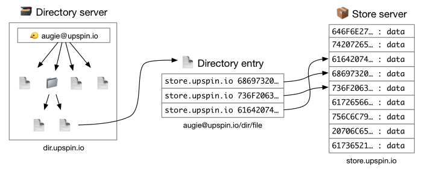
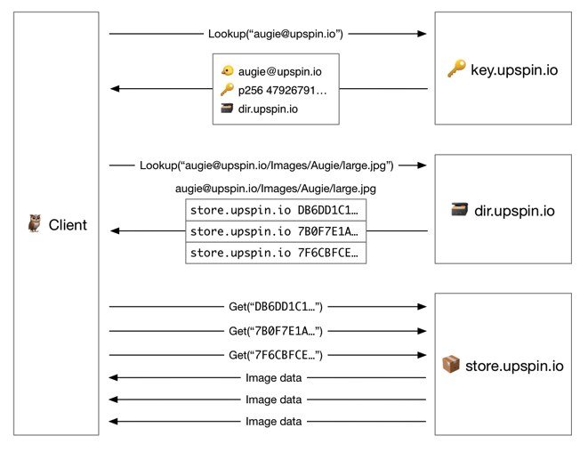

# Universal Namespace In the Cloud

## 1. Vision and Goals Of The Project

The vision for this project is to have a simple and replicable deployment process for deploying an instance of Upspin to the OpenShift cluster running on MOC. This would allow Upspin administrators (developers) to quickly host their own instance of OpenShift that could accept new users. At a minimum, we expect to deploy a single Upspin instance (served as store server and directory server at the same time) on the MOC’s OpenShift cluster, which handles all Upspin tasks (described in detail below). Time permitting, we will create a process for deploying two Upsin servers, one to host data and one to store the data-owner associations.

## 2. Users/Personas Of The Project
The primary users for our project are system administrators who wish to quickly deploy Upsin instances. There is a secondary use case for individuals who wish to use our Upsin server(s), but this will not be the focus of the project as use of upsin servers has been accomplished thoroughly. Once an Upsin instance is hosted somewhere, any user (developer or otherwise) can host data and give access to others, so a major bottleneck now is quickly and easily deploying Upsin instances.

## 3. Scope and Features Of The Project

Features:

-   Process to containerize Upsin:
	-   Will create a docker image/container of an upspin instance (combined store and directory server),
	-   Will include general steps to containerization and provide some automation.
-   Deploy a publicly accessible Upsin instance on the OpenShift MoC
-   Build on the project (TBD) could include:
	-   Explore scaling (separate store and directory deployments)
	-   Create cross-platform deployments using multiple cloud providers for storage
	-   Application integration

## 4. Solution Concept
#### Overview of Upspin architecture ([here](https://upspin.io/doc/arch.md))

An individual Upsin user is represented by a username to identify the user, public/private key pair, and a network address of a directory server.

The directory server (in our MVP, will be the same server as the store server) has an association between entries and references to actual data in the store server.

The key server holds the public key and directory server address for each user.

A full illustration of the client-server relationship for each server. To reiterate, our MVP will have a single, combined directory and store server.

#### Overview of OpenShift architecture

OpenShift is a distribution of Kubernetes. OpenShift will be used here to orchestrate the three different components of upsin which are keyserver, store and directory server. Upspin will be configured for deployment on OpenShift with the store and directory part of the same server.

## 5. Acceptance Criteria

Our minimum acceptance criteria is an Upspin instance deployed and publicly accessible on the OpenShift Massachusetts Open Cloud with a combined storage and directory server, which will store the actual data for items and the directory will give names to the data stored, and a repeatable process for deploying further Upsin instances.

Our stretch goals are to separate the Upspin store and directory deployments and create cross-platform deployments using multiple cloud providers for storage.

## 6. Release Planning

**Iteration 1:**
First iteration will consist of ramping up technical skills along with completion of fundamental tasks which are needed for the MVP. Some of the details of this iteration will be:

-   Getting hands-on with the product and understanding the architecture and functionality, this can include running upsin on local machines, going over the documentation.
    
-   Getting familiarized with docker and dockerizing the upsin binaries and making them available at repository.
    
-   Getting familiar with OpenShift as a system and understanding the basic building blocks of the same by.
    
**Iteration 2:**
This iteration will be mostly on the actual solution where the team would focus on design and strategy of deploying the upsin instance. One of the key tasks/deliverables of this iteration would be

  

-   Deciding on the approach of the design with regards to level of abstraction and ease of use the solution is going to provide to the user (level of automation).
    

  

Fine details of this iteration needs to be decided yet based on the outcome of iteration 1 and feedback from the mentors. Depending on the availability of resources (Time) further iterations will be planned post completion of the MVP.

## General comments
We have set the MVP to be a relatively low bar so that we choose the final form of the project once we’ve used Upspin + OpenShift and are aware of what works well and what doesn’t. Our hope is that more experience will help us better identify potential aspects of the project that can be expanded. Thus, we hope to complete the MVP and, time permitting, reset goals to include more features.
